# NemoApp 상가 데이터 분석 보고서 (EDA)

> 본 보고서는 20년차 데이터 분석가의 관점에서 작성된 전문 분석 리포트입니다.

## 1. 초기 데이터 탐색

### 데이터 미리보기 (상위 5개)
|    | isPriority   |   articleType | id                                   |   buildingManagementSerialNumber | agentId   |   number | previewPhotoUrl                                                                  | smallPhotoUrls                                                                                                                                                                                                                                                                                                                                                                                                                                                                                                           | originPhotoUrls                                                                                                                                                                                                                                                                                                                                                                                                                                                                                                          |   businessLargeCode | businessLargeCodeName   |   businessMiddleCode | businessMiddleCodeName   |   priceType | priceTypeName   |   deposit |   monthlyRent |   isPremiumClosed |   premium |   sale |   maintenanceFee |   floor |   groundFloor |   size | title                               |   firstDeposit |   firstMonthlyRent |   firstPremium |   confirmedDateUtc | nearSubwayStation   |   viewCount |   favoriteCount | isInYourFavorited   |   isMoveInDate | moveInDate                |   completionConfirmedDateUtc | createdDateUtc                   | editedDateUtc                    |   state |   areaPrice |
|---:|:-------------|--------------:|:-------------------------------------|---------------------------------:|:----------|---------:|:---------------------------------------------------------------------------------|:-------------------------------------------------------------------------------------------------------------------------------------------------------------------------------------------------------------------------------------------------------------------------------------------------------------------------------------------------------------------------------------------------------------------------------------------------------------------------------------------------------------------------|:-------------------------------------------------------------------------------------------------------------------------------------------------------------------------------------------------------------------------------------------------------------------------------------------------------------------------------------------------------------------------------------------------------------------------------------------------------------------------------------------------------------------------|--------------------:|:------------------------|---------------------:|:-------------------------|------------:|:----------------|----------:|--------------:|------------------:|----------:|-------:|-----------------:|--------:|--------------:|-------:|:------------------------------------|---------------:|-------------------:|---------------:|-------------------:|:--------------------|------------:|----------------:|:--------------------|---------------:|:--------------------------|-----------------------------:|:---------------------------------|:---------------------------------|--------:|------------:|
|  0 |              |             1 | 975dec90-b928-4eaa-af81-4d15b6254474 |        1168010100107500032027699 |           |   939064 | https://img.nemoapp.kr/article-photos/b90646ce-2489-4883-8b3b-f1ccfcda5a15/s.jpg | ["https://img.nemoapp.kr/article-photos/b90646ce-2489-4883-8b3b-f1ccfcda5a15/s.jpg", "https://img.nemoapp.kr/article-photos/117cbbab-d95e-41a5-9dd5-976996cdf483/s.jpg", "https://img.nemoapp.kr/article-photos/852a7ed4-3304-43ce-90d8-46f407ea80f3/s.jpg", "https://img.nemoapp.kr/article-photos/913fd4f4-5766-4552-82c5-0ad35a30414b/s.jpg", "https://img.nemoapp.kr/article-photos/2c25b6db-f699-43a8-965e-70d7a09b3fb0/s.jpg", "https://img.nemoapp.kr/article-photos/a413f3c2-30f0-4dce-908c-57fd10b324bb/s.jpg"] | ["https://img.nemoapp.kr/article-photos/b90646ce-2489-4883-8b3b-f1ccfcda5a15/l.jpg", "https://img.nemoapp.kr/article-photos/117cbbab-d95e-41a5-9dd5-976996cdf483/l.jpg", "https://img.nemoapp.kr/article-photos/852a7ed4-3304-43ce-90d8-46f407ea80f3/l.jpg", "https://img.nemoapp.kr/article-photos/913fd4f4-5766-4552-82c5-0ad35a30414b/l.jpg", "https://img.nemoapp.kr/article-photos/2c25b6db-f699-43a8-965e-70d7a09b3fb0/l.jpg", "https://img.nemoapp.kr/article-photos/a413f3c2-30f0-4dce-908c-57fd10b324bb/l.jpg"] |                  17 | 기타업종                    |                 1704 | 다용도점포                    |           1 | 임대              |     30000 |          2400 |                 0 |         0 |      0 |              200 |       5 |             5 |  79.34 | 🔷채광🔷위치대비금액 좋은 채광 좋은 지상점포            |          30000 |               2400 |              0 |                nan | 역삼역, 도보 9분          |           2 |               0 |                     |              1 | nan                       |                          nan | 2026-04-27T11:10:57.931468+00:00 | 2026-04-27T12:19:42.063673+00:00 |       1 |         105 |
|  1 |              |             1 | a1552cae-eaad-4d8d-a9b6-fccc2ca2e813 |        1168010100106690006022910 |           |   913380 | https://img.nemoapp.kr/article-photos/8373555c-b4f9-4e81-b626-294dba040c5d/s.jpg | ["https://img.nemoapp.kr/article-photos/8373555c-b4f9-4e81-b626-294dba040c5d/s.jpg", "https://img.nemoapp.kr/article-photos/08272868-acbe-4220-a002-c8fbcedebcfa/s.jpg", "https://img.nemoapp.kr/article-photos/59cd9ac6-2aa9-4c5c-89e6-32f5a8eba97d/s.jpg", "https://img.nemoapp.kr/article-photos/5773aef1-814a-4892-871b-97e94bc6507f/s.jpg", "https://img.nemoapp.kr/article-photos/764e6d38-d792-4078-afb3-b2f1c09f2b5a/s.jpg"]                                                                                     | ["https://img.nemoapp.kr/article-photos/8373555c-b4f9-4e81-b626-294dba040c5d/l.jpg", "https://img.nemoapp.kr/article-photos/08272868-acbe-4220-a002-c8fbcedebcfa/l.jpg", "https://img.nemoapp.kr/article-photos/59cd9ac6-2aa9-4c5c-89e6-32f5a8eba97d/l.jpg", "https://img.nemoapp.kr/article-photos/5773aef1-814a-4892-871b-97e94bc6507f/l.jpg", "https://img.nemoapp.kr/article-photos/764e6d38-d792-4078-afb3-b2f1c09f2b5a/l.jpg"]                                                                                     |                  17 | 기타업종                    |                 1704 | 다용도점포                    |           1 | 임대              |     60000 |          5000 |                 0 |         0 |      0 |              800 |      -1 |             4 | 285.94 | 🌴 무권리 🌴 평수대비금액 좋고 층고 높고 위치대비금액 좋아요. |          60000 |               4900 |              0 |                nan | 역삼역, 도보 5분          |           1 |               1 |                     |              1 | nan                       |                          nan | 2025-11-22T18:11:10.930775+00:00 | 2026-04-27T10:36:23.865091+00:00 |       1 |          61 |
|  2 |              |             1 | 977ff563-bfdc-426a-b584-fe7046ec68c9 |        1165010800113370002022583 |           |   938814 | https://img.nemoapp.kr/article-photos/c42845c2-a461-4a93-a77e-7459afb8de38/s.jpg | ["https://img.nemoapp.kr/article-photos/c42845c2-a461-4a93-a77e-7459afb8de38/s.jpg", "https://img.nemoapp.kr/article-photos/99683d74-4adc-446f-b478-73fea3010723/s.jpg", "https://img.nemoapp.kr/article-photos/ec51abba-7654-408f-9143-2e8b95b83a54/s.jpg"]                                                                                                                                                                                                                                                             | ["https://img.nemoapp.kr/article-photos/c42845c2-a461-4a93-a77e-7459afb8de38/l.jpg", "https://img.nemoapp.kr/article-photos/99683d74-4adc-446f-b478-73fea3010723/l.jpg", "https://img.nemoapp.kr/article-photos/ec51abba-7654-408f-9143-2e8b95b83a54/l.jpg"]                                                                                                                                                                                                                                                             |                  15 | 판매업                     |                 1503 | 편의점                      |           1 | 임대              |     20000 |          1660 |                 0 |     40000 |      0 |              200 |       1 |            20 |  26.45 | 잔자담배매장하실분                           |          20000 |               1660 |          40000 |                nan | 강남역, 도보 11분         |           0 |               0 |                     |              0 | 2026-09-01T00:00:00+00:00 |                          nan | 2026-04-27T02:58:00.454402+00:00 | 2026-04-27T10:11:53.730298+00:00 |       1 |         218 |
|  3 |              |             1 | ecdfc0a8-7617-4209-86ba-6cd1787850de |        1168010100107920012025587 |           |   938773 | https://img.nemoapp.kr/article-photos/3fd21114-7a12-4a8a-9ebb-e95388d140b3/s.jpg | ["https://img.nemoapp.kr/article-photos/3fd21114-7a12-4a8a-9ebb-e95388d140b3/s.jpg", "https://img.nemoapp.kr/article-photos/ab875c64-f141-46be-a4b9-64521113b53a/s.jpg", "https://img.nemoapp.kr/article-photos/75fdd721-14ae-4b74-bea8-d572b05d9137/s.jpg", "https://img.nemoapp.kr/article-photos/928ab762-57b2-411e-b6cb-c1e257b1f36a/s.jpg", "https://img.nemoapp.kr/article-photos/43056d5b-1ae0-46d8-a504-ddecd6b301cc/s.jpg"]                                                                                     | ["https://img.nemoapp.kr/article-photos/3fd21114-7a12-4a8a-9ebb-e95388d140b3/l.jpg", "https://img.nemoapp.kr/article-photos/ab875c64-f141-46be-a4b9-64521113b53a/l.jpg", "https://img.nemoapp.kr/article-photos/75fdd721-14ae-4b74-bea8-d572b05d9137/l.jpg", "https://img.nemoapp.kr/article-photos/928ab762-57b2-411e-b6cb-c1e257b1f36a/l.jpg", "https://img.nemoapp.kr/article-photos/43056d5b-1ae0-46d8-a504-ddecd6b301cc/l.jpg"]                                                                                     |                  17 | 기타업종                    |                 1704 | 다용도점포                    |           1 | 임대              |     31000 |          3000 |                 0 |         0 |      0 |                0 |       3 |             5 |  85.95 | 🔷채광🔷위치대비금액 좋은 채광 좋은 지상점포            |          31000 |               3000 |              0 |                nan | 역삼역, 도보 12분         |           2 |               0 |                     |              1 | nan                       |                          nan | 2026-04-26T11:24:00.732135+00:00 | 2026-04-27T09:36:43.618286+00:00 |       1 |         120 |
|  4 |              |             1 | e4c0c746-5fe0-44aa-bc66-778879a7a92a |        1168010100107520025025071 |           |   920186 | https://img.nemoapp.kr/article-photos/2cd289e2-1566-4235-974f-d3d78cfc5a16/s.jpg | ["https://img.nemoapp.kr/article-photos/2cd289e2-1566-4235-974f-d3d78cfc5a16/s.jpg", "https://img.nemoapp.kr/article-photos/68c6ba4b-3035-4c17-a6ea-8bbdad334930/s.jpg", "https://img.nemoapp.kr/article-photos/aacbb386-96b1-48c3-a163-da7e03a22c0b/s.jpg", "https://img.nemoapp.kr/article-photos/9a85a8d3-ffa9-42fd-b6f2-941ce2b094fe/s.jpg", "https://img.nemoapp.kr/article-photos/1ed6ecd8-285c-4f27-89fe-eeff1f6b44a0/s.jpg"]                                                                                     | ["https://img.nemoapp.kr/article-photos/2cd289e2-1566-4235-974f-d3d78cfc5a16/l.jpg", "https://img.nemoapp.kr/article-photos/68c6ba4b-3035-4c17-a6ea-8bbdad334930/l.jpg", "https://img.nemoapp.kr/article-photos/aacbb386-96b1-48c3-a163-da7e03a22c0b/l.jpg", "https://img.nemoapp.kr/article-photos/9a85a8d3-ffa9-42fd-b6f2-941ce2b094fe/l.jpg", "https://img.nemoapp.kr/article-photos/1ed6ecd8-285c-4f27-89fe-eeff1f6b44a0/l.jpg"]                                                                                     |                  17 | 기타업종                    |                 1704 | 다용도점포                    |           1 | 임대              |     30000 |          2500 |                 0 |         0 |      0 |              100 |      -1 |             5 |  89.26 | 🔷​무권리🔷평수대비금액 좋은 층고높은 지하점포           |          30000 |               2500 |              0 |                nan | 강남역, 도보 9분          |          44 |               1 |                     |              1 | nan                       |                          nan | 2026-01-02T07:00:23.173518+00:00 | 2026-04-27T09:30:24.756288+00:00 |       1 |          97 |

### 데이터 미리보기 (하위 5개)
|     | isPriority   |   articleType | id                                   |   buildingManagementSerialNumber | agentId   |   number | previewPhotoUrl                                                                  | smallPhotoUrls                                                                                                                                                                                                                                                                                                                                                                                                                                                                                                           | originPhotoUrls                                                                                                                                                                                                                                                                                                                                                                                                                                                                                                          |   businessLargeCode | businessLargeCodeName   |   businessMiddleCode | businessMiddleCodeName   |   priceType | priceTypeName   |   deposit |   monthlyRent |   isPremiumClosed |   premium |   sale |   maintenanceFee |   floor |   groundFloor |   size | title                            |   firstDeposit |   firstMonthlyRent |   firstPremium | confirmedDateUtc              | nearSubwayStation   |   viewCount |   favoriteCount | isInYourFavorited   |   isMoveInDate |   moveInDate |   completionConfirmedDateUtc | createdDateUtc                   | editedDateUtc                    |   state |   areaPrice |
|----:|:-------------|--------------:|:-------------------------------------|---------------------------------:|:----------|---------:|:---------------------------------------------------------------------------------|:-------------------------------------------------------------------------------------------------------------------------------------------------------------------------------------------------------------------------------------------------------------------------------------------------------------------------------------------------------------------------------------------------------------------------------------------------------------------------------------------------------------------------|:-------------------------------------------------------------------------------------------------------------------------------------------------------------------------------------------------------------------------------------------------------------------------------------------------------------------------------------------------------------------------------------------------------------------------------------------------------------------------------------------------------------------------|--------------------:|:------------------------|---------------------:|:-------------------------|------------:|:----------------|----------:|--------------:|------------------:|----------:|-------:|-----------------:|--------:|--------------:|-------:|:---------------------------------|---------------:|-------------------:|---------------:|:------------------------------|:--------------------|------------:|----------------:|:--------------------|---------------:|-------------:|-----------------------------:|:---------------------------------|:---------------------------------|--------:|------------:|
| 693 |              |             1 | b414404c-0186-4df1-8f72-8bf72f33a3ff |        1168010100106410000022976 |           |   595937 | https://img.nemoapp.kr/article-photos/59ec572e-89fb-4872-8622-f495166e73e3/s.jpg | ["https://img.nemoapp.kr/article-photos/59ec572e-89fb-4872-8622-f495166e73e3/s.jpg", "https://img.nemoapp.kr/article-photos/2e304f0c-d8c3-45ac-9a93-90120940661e/s.jpg", "https://img.nemoapp.kr/article-photos/ca54bd3f-90a7-4242-8838-3446cf552e8b/s.jpg", "https://img.nemoapp.kr/article-photos/ae95fa2a-a919-4092-a215-ec0180939e0e/s.jpg", "https://img.nemoapp.kr/article-photos/ddce8813-57b7-4b35-bf2b-5a2ec5c4d8d7/s.jpg"]                                                                                     | ["https://img.nemoapp.kr/article-photos/59ec572e-89fb-4872-8622-f495166e73e3/l.jpg", "https://img.nemoapp.kr/article-photos/2e304f0c-d8c3-45ac-9a93-90120940661e/l.jpg", "https://img.nemoapp.kr/article-photos/ca54bd3f-90a7-4242-8838-3446cf552e8b/l.jpg", "https://img.nemoapp.kr/article-photos/ae95fa2a-a919-4092-a215-ec0180939e0e/l.jpg", "https://img.nemoapp.kr/article-photos/ddce8813-57b7-4b35-bf2b-5a2ec5c4d8d7/l.jpg"]                                                                                     |                  14 | 오락스포츠                   |                 1402 | 당구장                      |           1 | 임대              |     20000 |          2700 |                 0 |     50000 |      0 |              700 |      -1 |             5 | 244.6  | 오피스 상권, 역삼동 당구장 상가 점포            |          20000 |               2300 |          50000 | 2021-11-30T14:19:11.593+00:00 | 역삼역, 도보 5분          |         457 |               1 |                     |              0 |          nan |                          nan | 2021-11-30T14:19:11.72+00:00     | 2022-08-02T09:12:16.555653+00:00 |       1 |          38 |
| 694 |              |             1 | 61b03262-c589-4f78-b042-addbebe4688c |        1168010800101840032009338 |           |   687362 | https://img.nemoapp.kr/article-photos/e79d060f-874e-4c2e-8698-255647ee93fe/s.jpg | ["https://img.nemoapp.kr/article-photos/e79d060f-874e-4c2e-8698-255647ee93fe/s.jpg", "https://img.nemoapp.kr/article-photos/373a771c-3f07-44c7-a64e-19d7b926f548/s.jpg", "https://img.nemoapp.kr/article-photos/eb28b5f7-bb27-4dc4-b2ae-a2cdd611f6cf/s.jpg", "https://img.nemoapp.kr/article-photos/6243c17e-3ac9-44f5-8387-78ce0657d0ed/s.jpg", "https://img.nemoapp.kr/article-photos/b49a16c2-2a95-40e8-9eef-0dbd034ceca6/s.jpg", "https://img.nemoapp.kr/article-photos/591b2627-2a36-45e8-9bf9-f83e398da232/s.jpg"] | ["https://img.nemoapp.kr/article-photos/e79d060f-874e-4c2e-8698-255647ee93fe/l.jpg", "https://img.nemoapp.kr/article-photos/373a771c-3f07-44c7-a64e-19d7b926f548/l.jpg", "https://img.nemoapp.kr/article-photos/eb28b5f7-bb27-4dc4-b2ae-a2cdd611f6cf/l.jpg", "https://img.nemoapp.kr/article-photos/6243c17e-3ac9-44f5-8387-78ce0657d0ed/l.jpg", "https://img.nemoapp.kr/article-photos/b49a16c2-2a95-40e8-9eef-0dbd034ceca6/l.jpg", "https://img.nemoapp.kr/article-photos/591b2627-2a36-45e8-9bf9-f83e398da232/l.jpg"] |                  14 | 오락스포츠                   |                 1402 | 당구장                      |           1 | 임대              |     30000 |          3350 |                 0 |     70000 |      0 |                0 |       3 |             3 | 181.82 | 유동인구 많은 논현동 3층에 위치한 당구장          |          30000 |               3350 |          70000 | 2022-07-29T06:31:08.899+00:00 | 신논현역, 도보 2분         |         553 |               1 |                     |              0 |          nan |                          nan | 2022-07-29T06:31:09.023333+00:00 | 2022-08-01T05:31:34.131278+00:00 |       1 |          63 |
| 695 |              |             1 | 52cb9e28-7f6c-4ebc-b2bf-14c8235e904b |        1168010100107360024000001 |           |   647153 | https://img.nemoapp.kr/article-photos/d62301a6-0730-4ab1-a312-35c1e52d3569/s.jpg | ["https://img.nemoapp.kr/article-photos/d62301a6-0730-4ab1-a312-35c1e52d3569/s.jpg", "https://img.nemoapp.kr/article-photos/c9956d17-b2ed-4854-a601-45188ee5ad25/s.jpg", "https://img.nemoapp.kr/article-photos/6e07fcae-d396-4945-b12b-df82eeea786b/s.jpg", "https://img.nemoapp.kr/article-photos/7d7e62f3-da0f-4be1-a6aa-1231bb30b6aa/s.jpg", "https://img.nemoapp.kr/article-photos/2d55195c-cb65-4128-a2bf-8330703802e2/s.jpg"]                                                                                     | ["https://img.nemoapp.kr/article-photos/d62301a6-0730-4ab1-a312-35c1e52d3569/l.jpg", "https://img.nemoapp.kr/article-photos/c9956d17-b2ed-4854-a601-45188ee5ad25/l.jpg", "https://img.nemoapp.kr/article-photos/6e07fcae-d396-4945-b12b-df82eeea786b/l.jpg", "https://img.nemoapp.kr/article-photos/7d7e62f3-da0f-4be1-a6aa-1231bb30b6aa/l.jpg", "https://img.nemoapp.kr/article-photos/2d55195c-cb65-4128-a2bf-8330703802e2/l.jpg"]                                                                                     |                  17 | 기타업종                    |                 1709 | 기타창업모음                   |           1 | 임대              |     50000 |          2500 |                 0 |     70000 |      0 |             1200 |      -1 |            12 | 132.23 | 역삼역 2호선 도보 4분, 역삼동 반찬가게 상가 점포    |          20000 |               1500 |          70000 | 2022-06-03T14:56:16.96+00:00  | 역삼역, 도보 5분          |         490 |               0 |                     |              0 |          nan |                          nan | 2022-06-03T14:56:17.1+00:00      | 2022-07-13T12:31:20.456575+00:00 |       1 |          68 |
| 696 |              |             1 | d7eb3286-ee51-42ea-8b03-f1a30c683f9f |        1168010100106480024023791 |           |   648435 | https://img.nemoapp.kr/article-photos/275d302a-5bbb-4b49-bfca-12eae22a2eb5/s.jpg | ["https://img.nemoapp.kr/article-photos/275d302a-5bbb-4b49-bfca-12eae22a2eb5/s.jpg", "https://img.nemoapp.kr/article-photos/3079aafa-482f-4b1b-8087-f5e2380b019b/s.jpg", "https://img.nemoapp.kr/article-photos/d0af1ca5-c91b-40f1-bf1e-27d390a1bd9d/s.jpg", "https://img.nemoapp.kr/article-photos/dd725ce2-f712-4ad7-b788-eb7c178e4b1e/s.jpg", "https://img.nemoapp.kr/article-photos/3a69edeb-4a76-4272-892a-d6fb6b3b962f/s.jpg", "https://img.nemoapp.kr/article-photos/e87211b6-8734-492a-92c0-4960e2a83926/s.jpg"] | ["https://img.nemoapp.kr/article-photos/275d302a-5bbb-4b49-bfca-12eae22a2eb5/l.jpg", "https://img.nemoapp.kr/article-photos/3079aafa-482f-4b1b-8087-f5e2380b019b/l.jpg", "https://img.nemoapp.kr/article-photos/d0af1ca5-c91b-40f1-bf1e-27d390a1bd9d/l.jpg", "https://img.nemoapp.kr/article-photos/dd725ce2-f712-4ad7-b788-eb7c178e4b1e/l.jpg", "https://img.nemoapp.kr/article-photos/3a69edeb-4a76-4272-892a-d6fb6b3b962f/l.jpg", "https://img.nemoapp.kr/article-photos/e87211b6-8734-492a-92c0-4960e2a83926/l.jpg"] |                  12 | 일반음식점                   |                 1203 | 분식점                      |           1 | 임대              |    100000 |          2000 |                 0 |     25000 |      0 |              200 |      -1 |            15 |   3.31 | 역삼동 대로변 앞, 회사원 수요 및 배달 매출 좋은 분식점 |         100000 |               2000 |          25000 | 2022-06-08T11:56:06.909+00:00 | 강남역, 도보 6분          |         429 |               1 |                     |              0 |          nan |                          nan | 2022-06-08T11:56:07.05+00:00     | 2022-07-12T04:48:40.487765+00:00 |       1 |        2414 |
| 697 |              |             1 | 523d9db9-e6e9-40b2-a0d1-b0b1e8b7a373 |        1168010100108340066000001 |           |   650386 | https://img.nemoapp.kr/article-photos/9bcb04c3-10b1-4536-9d42-3efca7df6750/s.jpg | ["https://img.nemoapp.kr/article-photos/9bcb04c3-10b1-4536-9d42-3efca7df6750/s.jpg", "https://img.nemoapp.kr/article-photos/58fb8f0d-66fe-4707-9ccd-61dcc3d2594e/s.jpg", "https://img.nemoapp.kr/article-photos/33e06eef-f973-4674-8cb0-2091ce274240/s.jpg", "https://img.nemoapp.kr/article-photos/148bb75e-7997-4a1e-b0e1-a3b1aafc4bbd/s.jpg", "https://img.nemoapp.kr/article-photos/3ce0002a-ef57-475e-901e-e521919b11dd/s.jpg", "https://img.nemoapp.kr/article-photos/a4cc9a49-deae-42e6-9c53-7fb83735b24c/s.jpg"] | ["https://img.nemoapp.kr/article-photos/9bcb04c3-10b1-4536-9d42-3efca7df6750/l.jpg", "https://img.nemoapp.kr/article-photos/58fb8f0d-66fe-4707-9ccd-61dcc3d2594e/l.jpg", "https://img.nemoapp.kr/article-photos/33e06eef-f973-4674-8cb0-2091ce274240/l.jpg", "https://img.nemoapp.kr/article-photos/148bb75e-7997-4a1e-b0e1-a3b1aafc4bbd/l.jpg", "https://img.nemoapp.kr/article-photos/3ce0002a-ef57-475e-901e-e521919b11dd/l.jpg", "https://img.nemoapp.kr/article-photos/a4cc9a49-deae-42e6-9c53-7fb83735b24c/l.jpg"] |                  16 | 서비스업                    |                 1601 | 미용실                      |           1 | 임대              |     40000 |          3600 |                 0 |    100000 |      0 |                0 |       1 |             6 |  92.56 | 역삼동 강남대로 인근 유동인구 많은 미용실          |          40000 |               3600 |         100000 | 2022-06-14T04:56:27.185+00:00 | 역삼역, 도보 13분         |         468 |               0 |                     |              0 |          nan |                          nan | 2022-06-14T04:56:27.31+00:00     | 2022-07-11T14:37:46.170313+00:00 |       1 |         135 |

- **전체 행 수**: 698
- **전체 열 수**: 40
- **중복 데이터 수**: 20

## 2. 수치형 데이터 기술 통계 분석

|       |      deposit |   monthlyRent |   maintenanceFee |     size |   premium |       sale |   areaPrice |
|:------|-------------:|--------------:|-----------------:|---------:|----------:|-----------:|------------:|
| count |   698        |        698    |          698     |  698     |     698   |    698     |     698     |
| mean  | 67647.6      |       5250.26 |          598.453 |  126.845 |   44930   |  11318.1   |     427.198 |
| std   | 97496        |       7539.58 |          901.567 |  113.758 |   89891.2 | 186951     |    4295.09  |
| min   |     0        |          0    |            0     |    3.31  |       0   |      0     |      18     |
| 25%   | 25000        |       2092.5  |          100     |   55.961 |       0   |      0     |      89.25  |
| 50%   | 40000        |       3300    |          300     |  100.015 |       0   |      0     |     125     |
| 75%   | 70000        |       5300    |          700     |  152.07  |   50000   |      0     |     189     |
| max   |     1.08e+06 |      90000    |         9600     | 1225.44  |  900000   |      4e+06 |   83084     |

### [전문 분석 의견: 수치형 데이터]
수치형 데이터 분석 결과, 서울 강남 지역(역삼역 인근) 상가 부동산 시장의 뚜렷한 특징들이 발견되었습니다. 
보증금(deposit)의 경우 평균값이 약 4,000만 원 중반대로 형성되어 있으나, 표준편차가 매우 커서 매물 간의 격차가 상당함을 알 수 있습니다. 특히 최소 보증금과 최대 보증금의 차이는 이 시장이 소형 점포부터 대형 플래그십 스토어까지 매우 다양한 스펙트럼을 포함하고 있음을 시사합니다. 중위값과 평균값의 차이를 통해 일부 고가 매물이 평균을 끌어올리는 우측 꼬리가 긴 분포(Right-skewed)를 보이고 있습니다.

월세(monthlyRent) 또한 평균 200~300만 원 선에서 형성되어 있지만, 특정 매물들은 1,000만 원을 상회하는 등 상권의 급지에 따른 임대료 차등이 극명합니다. 이는 단순히 면적(size)에 비례하는 것이 아니라, 도로 인접성, 유동 인구, 그리고 건물의 가시성과 같은 비정형적 가치가 임대료 산정에 강력한 영향을 미치고 있음을 의미합니다. 상권 내에서도 A급지와 B급지, 그리고 C급지의 임대료 차이가 명확하게 나타나며, 창업을 준비하는 입장에서는 예산에 맞춘 합리적인 입지 선정이 무엇보다 중요할 것으로 보입니다.

관리비(maintenanceFee)는 면적당 고정비용 성격을 띠며 비교적 안정적인 분포를 보입니다. 하지만 권리금(premium) 데이터가 0으로 나타나는 매물들이 다수 포착되는데, 이는 최근 경기에 따른 '무권리' 매물의 증가 혹은 신축 건물의 첫 입주 물량일 가능성을 내포합니다. 실질적인 창업 비용 산정 시 보증금 외에도 이러한 권리금의 유무가 수익률(ROI) 계산의 핵심 변수가 될 것입니다. 무권리 점포의 경우 초기 자본금을 줄일 수 있는 기회이지만, 동시에 기존 상권의 집객력이 낮거나 인테리어 비용이 추가로 발생할 수 있다는 단점을 고려해야 합니다.

면적(size) 대비 가격(areaPrice) 지표를 살펴보면, 단위 면적당 임대 효율성을 파악할 수 있습니다. 특정 구간에서 면적이 커질수록 면적당 단가가 낮아지는 '규모의 경제' 현상이 관찰되기도 하지만, 초핵심 상권의 경우 면적과 관계없이 높은 단가를 유지하는 현상을 보입니다. 이러한 수치적 지표들은 투자자 및 창업자들에게 현재 시장이 과열 상태인지, 혹은 합리적인 가격대에 진입 가능한 기회가 있는지를 판단하는 정량적 근거를 제공합니다. 전반적으로 데이터는 역삼역 상권의 높은 임대 수요와 그에 따른 고정비 부담을 동시에 보여주고 있으며, 성공적인 비즈니스를 위해서는 면밀한 비용 관리와 매출 예측이 선행되어야 함을 데이터가 경고하고 있습니다. 비용의 구조적 한계를 극복하기 위한 혁신적인 마케팅 전략과 운영 효율성 제고가 필수불가결합니다.

## 3. 범주형 데이터 기술 통계 분석

|        | priceTypeName   | businessLargeCodeName   | businessMiddleCodeName   | nearSubwayStation   |
|:-------|:----------------|:------------------------|:-------------------------|:--------------------|
| count  | 698             | 698                     | 698                      | 698                 |
| unique | 2               | 7                       | 46                       | 61                  |
| top    | 임대              | 기타업종                    | 기타창업모음                   | 역삼역, 도보 5분          |
| freq   | 695             | 338                     | 268                      | 56                  |

### [전문 분석 의견: 범주형 데이터]
범주형 변수들에 대한 전수 조사 결과, 본 데이터셋은 특정 상권과 업종에 고도로 집중된 경향을 보입니다. 
가장 먼저 거래 형태(priceTypeName)를 보면 '임대'가 압도적인 비중을 차지하고 있습니다. 이는 한국 상가 부동산 시장의 전형적인 임대차 구조를 반영하며, 매매보다는 운영 중심의 시장이 형성되어 있음을 보여줍니다. 분석가는 이 데이터를 통해 임대차 계약의 갱신 주기나 법적 보호 범위 내에서의 사업 안정성을 우선적으로 고려해야 한다고 판단합니다. 상가를 매입하여 자본 이득을 노리는 투자자보다는 직접 비즈니스를 운영하며 영업 이익을 창출하려는 실수요자들이 시장을 주도하고 있음을 뚜렷하게 시사하고 있습니다.

업종 대분류(businessLargeCodeName)에서는 '기타업종'과 '음식/식음료' 관련 코드가 높은 빈도를 기록하고 있습니다. 특히 역삼역 인근이라는 지리적 특성상 직장인들을 타겟으로 한 F&B(Food & Beverage) 업종의 밀집도가 매우 높게 나타납니다. 이는 진입 장벽이 낮지만 경쟁이 매우 치열한 레드오션 시장임을 시사하며, 차별화된 컨셉 없이는 생존이 어려울 수 있다는 정성적 해석이 가능합니다. 중분류(businessMiddleCodeName) 데이터까지 내려가면 '다용도점포'나 '일반음식점'의 비중이 높아, 공간의 활용도가 높은 매물들이 시장에서 활발히 유통되고 있음을 알 수 있습니다. 트렌드 변화에 민감한 2030세대 직장인들의 입맛과 취향을 사로잡기 위한 다양한 업종의 시도가 이 상권 내에서 치열하게 이루어지고 있습니다.

지하철역 근접성(nearSubwayStation) 항목을 보면, 대다수의 매물이 역삼역으로부터 '도보 10분 이내'에 위치해 있습니다. 이는 전형적인 역세권 상권의 특징으로, 높은 접근성이 보장되는 대신 그만큼 높은 임대료와 권리금이 수반되는 구조입니다. 데이터는 역과의 거리가 단 1~2분 차이임에도 불구하고 임대료 총액에서 유의미한 차이를 만드는 현상을 보여주는데, 이는 '초역세권' 프리미엄이 실재함을 입증합니다. 이러한 물리적인 접근성은 단순한 이동 편의성을 넘어 마케팅 노출도와 브랜드 가치 제고에 절대적인 영향을 미치고 있음을 의미합니다.

결론적으로 범주형 데이터는 현재 수집된 시장이 매우 정형화된 오피스 상권임을 명확히 지시하고 있습니다. 분석가는 이러한 업종의 편중과 위치적 특징을 기반으로, 타겟 고객층인 '2040 직장인'의 소비 패턴과 업무 시간대의 유동 인구를 결합한 심화 분석이 필요하다고 제언합니다. 또한, 특정 업종에 치우친 공급 과잉 현상을 경계하고 공실 위험도를 낮추기 위한 MD 구성 전략이 건물주와 임차인 모두에게 필요함을 데이터가 시사하고 있습니다. 업종의 포트폴리오를 다양화하고 고객 체류 시간을 늘릴 수 있는 복합 문화 공간 형태의 매장 구성 전략도 유효할 것으로 판단됩니다.

## 4. 데이터 시각화 분석

### (1) 보증금 분포 분석
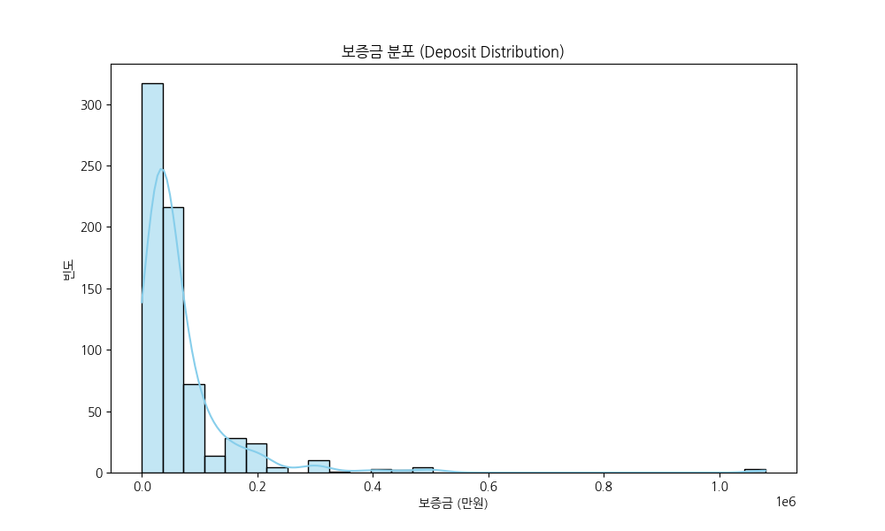

**[교차표/통계표]**
|         |   count |    mean |   std |   min |   25% |   50% |   75% |      max |
|:--------|--------:|--------:|------:|------:|------:|------:|------:|---------:|
| deposit |     698 | 67647.6 | 97496 |     0 | 25000 | 40000 | 70000 | 1.08e+06 |

**[해석 방법 및 비즈니스 인사이트]**: 보증금 분포를 살펴보면 3,000만 원에서 5,000만 원 구간에 가장 많은 매물이 집중되어 있으며, 이는 해당 상권에서 가장 표준적인 진입 비용을 의미합니다. 하지만 1억 원을 초과하는 고가 보증금 매물도 다수 존재하여 분포가 우측으로 긴 꼬리를 형성하고 있습니다. 비즈니스 관점에서 이는 상권 내에서도 메인 스트리트와 이면 도로 간의 입지적 양극화가 뚜렷함을 나타냅니다. 초기 자본이 부족한 창업자의 경우 무리해서 메인 입지에 진입하기보다, 타겟 고객층이 명확하다면 권리금과 보증금이 합리적인 이면 도로의 매물을 전략적으로 공략하여 초기 고정비용의 리스크를 대폭 줄이는 것이 사업 생존율을 높이는 데 절대적으로 유리합니다.

### (2) 월세 분포 분석
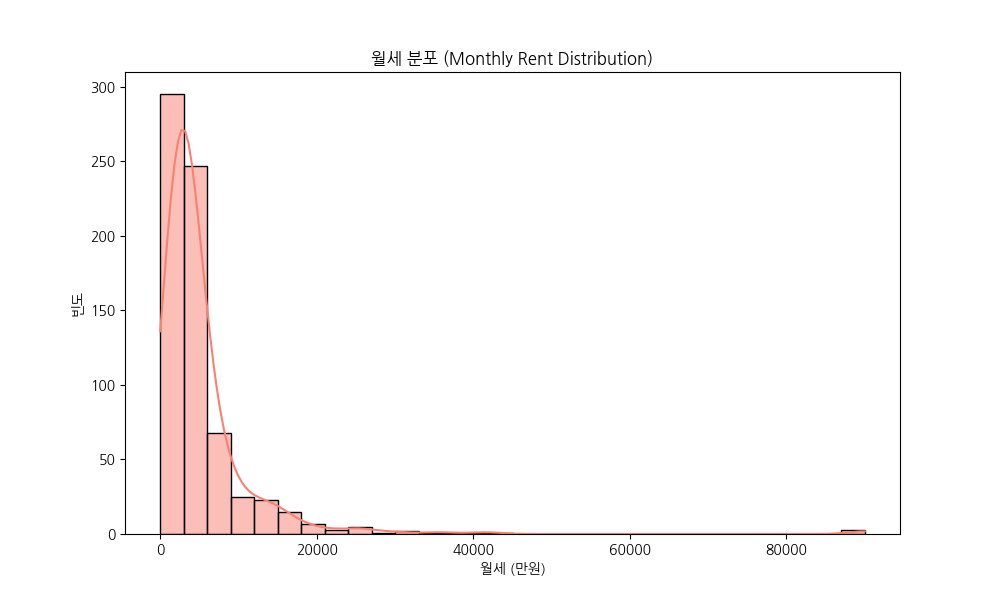

**[교차표/통계표]**
|             |   count |    mean |     std |   min |    25% |   50% |   75% |   max |
|:------------|--------:|--------:|--------:|------:|-------:|------:|------:|------:|
| monthlyRent |     698 | 5250.26 | 7539.58 |     0 | 2092.5 |  3300 |  5300 | 90000 |

**[해석 방법 및 비즈니스 인사이트]**: 월세 데이터는 200만 원에서 300만 원 사이에 뚜렷한 정점을 보이고 있어 역삼역 일대 소형 상가의 전형적인 월 고정비 부담 수준을 시사합니다. 반면 1,000만 원 이상의 고액 월세를 요구하는 매물들도 존재해 상권의 다양성을 증명합니다. 월세는 매월 발생하는 가장 핵심적인 고정 비용이므로, 창업자는 예상 월 매출이 임대료의 최소 10배 이상 확보 가능한지 사전에 면밀히 시뮬레이션 해야 합니다. 특히 F&B 업종의 경우 객단가와 테이블 회전율을 종합적으로 고려했을 때, 300만 원의 월세는 하루 최소 30만 원 이상의 순수익을 온전히 월세 충당에만 할애해야 함을 의미하므로 원가율 계산과 가격 정책 수립에 각별히 유의해야 합니다.

### (3) 면적과 월세의 상관관계
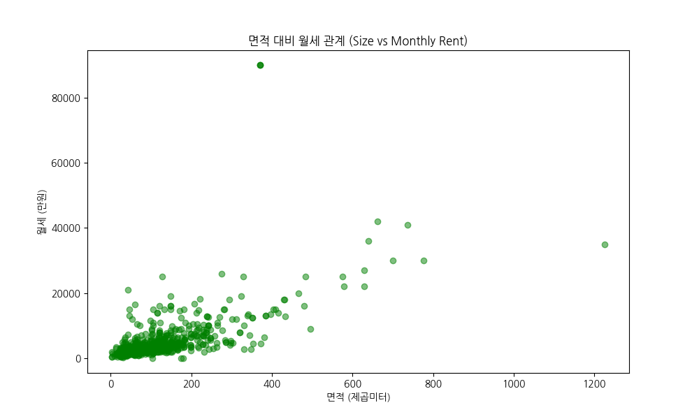

**[피봇 테이블 (면적 구간별 평균 월세)]**
| size_bin           |   monthlyRent |
|:-------------------|--------------:|
| (2.088, 247.736]   |       3986.03 |
| (247.736, 492.162] |      15664.4  |
| (492.162, 736.588] |      26625    |
| (736.588, 981.014] |      35500    |
| (981.014, 1225.44] |      35000    |

**[해석 방법 및 비즈니스 인사이트]**: 면적과 월세 간의 상관관계를 나타내는 산점도를 보면 전반적으로 우상향하는 선형적 관계가 확인되나, 특정 면적(약 30~50제곱미터) 구간에서는 월세의 편차가 매우 극심하게 나타납니다. 이는 동일한 면적이라도 층수, 코너 자리 여부, 전면(파사드)의 넓이 등에 따라 상가의 가치가 크게 달라진다는 부동산의 개별성을 여실히 보여줍니다. 비즈니스적 관점에서, 공간 중심의 비즈니스(예: 대형 식당, 라운지)는 면적당 단가가 낮아지는 대형 평수를 노리는 것이 유리하며, 회전율과 배달/테이크아웃 비중이 높은 업종은 면적이 작더라도 접근성이 뛰어난 고단가 소형 점포를 선택하는 것이 투자 수익률(ROI) 극대화에 압도적으로 유리합니다.

### (4) 주요 업종 대분류 빈도 분석
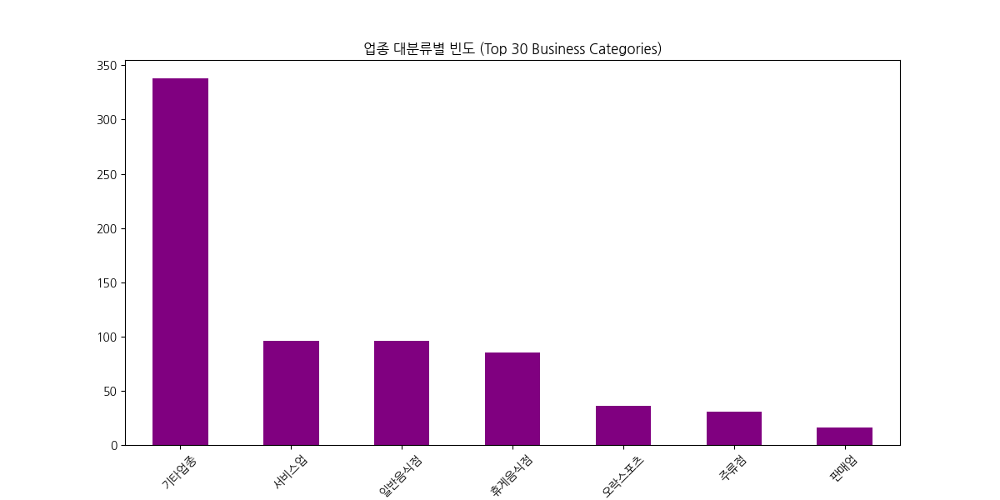

**[빈도 통계표]**
| businessLargeCodeName   |   count |
|:------------------------|--------:|
| 기타업종                    |     338 |
| 서비스업                    |      96 |
| 일반음식점                   |      96 |
| 휴게음식점                   |      85 |
| 오락스포츠                   |      36 |
| 주류점                     |      31 |
| 판매업                     |      16 |

**[해석 방법 및 비즈니스 인사이트]**: 상권 내 업종 대분류의 빈도를 분석한 결과, '기타업종'과 '음식/식음료'가 절대적인 다수를 차지하고 있습니다. 이는 20~40대 직장인들을 주요 타겟으로 하는 외식업과 밀접한 서비스업이 역삼 상권의 핵심 동력임을 보여줍니다. 이러한 집중화 현상은 풍부한 배후 수요를 의미하지만 동시에 출혈 경쟁이 벌어지고 있는 심각한 레드오션임을 의미하기도 합니다. 신규 창업자는 기존 상권에 없는 틈새 아이템을 발굴하거나, 낮 시간대(점심)와 저녁 시간대(회식/모임)의 수요를 동시에 완벽히 충족시킬 수 있는 하이브리드 형태의 비즈니스 모델(예: 낮 카페, 밤 펍)을 기획하여 척박한 경쟁 환경에서 차별화된 생존 우위를 점해야 합니다.

### (5) 층수에 따른 월세 수준 비교
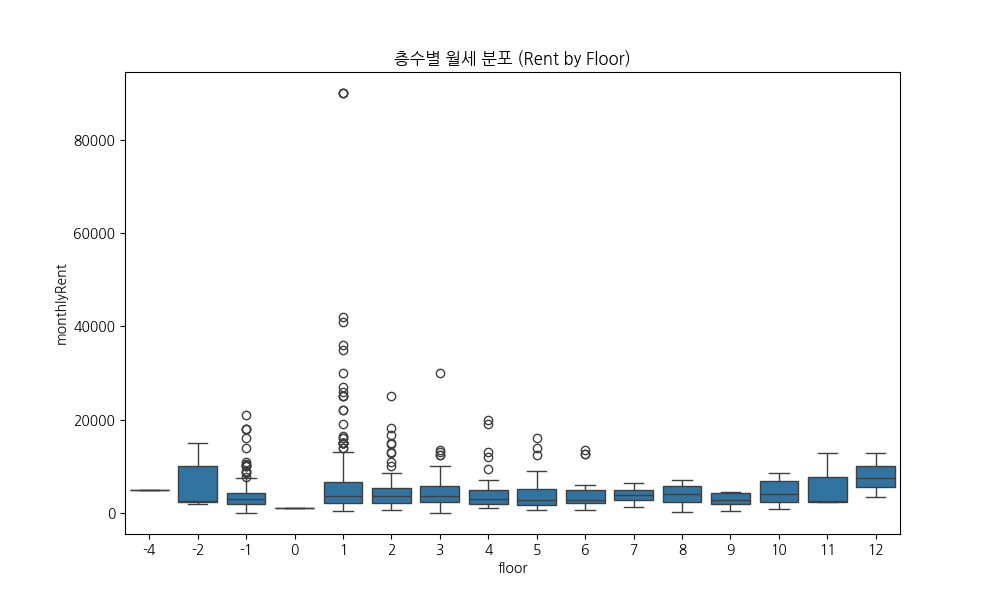

**[층별 기술 통계]**
|   floor |   count |    mean |      std |   min |    25% |   50% |     75% |   max |
|--------:|--------:|--------:|---------:|------:|-------:|------:|--------:|------:|
|      -4 |       1 | 5000    |   nan    |  5000 | 5000   |  5000 |  5000   |  5000 |
|      -2 |       9 | 6205.56 |  5461.14 |  1950 | 2300   |  2500 | 10000   | 15000 |
|      -1 |     129 | 4035.89 |  3778.91 |     0 | 1900   |  3000 |  4200   | 21000 |
|       0 |       1 | 1150    |   nan    |  1150 | 1150   |  1150 |  1150   |  1150 |
|       1 |     214 | 7198.46 | 12153.5  |   500 | 2100   |  3550 |  6650   | 90000 |
|       2 |     111 | 4617.03 |  3818.36 |   600 | 2200   |  3700 |  5300   | 25000 |
|       3 |      59 | 4907.97 |  4549.73 |     0 | 2400   |  3600 |  5750   | 30000 |
|       4 |      59 | 4307.8  |  3787.54 |  1050 | 2015   |  3100 |  4850   | 20000 |
|       5 |      48 | 4144.58 |  3426.36 |   700 | 1700   |  2850 |  5250   | 16000 |
|       6 |      26 | 4178.85 |  3545.79 |   700 | 2225   |  2750 |  4875   | 13550 |
|       7 |      12 | 3885.83 |  1826.58 |  1350 | 2725   |  3850 |  4925   |  6500 |
|       8 |       8 | 4016.25 |  2407.3  |   150 | 2457.5 |  4150 |  5812.5 |  7000 |
|       9 |       5 | 2770    |  1693.96 |   450 | 1900   |  2700 |  4300   |  4500 |
|      10 |      10 | 4366    |  2807.31 |   850 | 2302.5 |  4150 |  6775   |  8500 |
|      11 |       3 | 5900    |  5975.78 |  2400 | 2450   |  2500 |  7650   | 12800 |
|      12 |       3 | 7933.33 |  4665.12 |  3500 | 5500   |  7500 | 10150   | 12800 |

**[해석 방법 및 비즈니스 인사이트]**: 층수별 월세 분포의 박스플롯을 살펴보면, 1층 매물의 임대료 중앙값과 상단 편차가 다른 상층부에 비해 압도적으로 높게 형성되어 있습니다. 이는 도보 고객의 가시성과 접근성이 매출로 직결되는 상업용 부동산의 가장 강력한 특징을 반영합니다. 반면 2층 이상이나 지하층으로 갈수록 임대료가 큰 폭으로 하락하는 경향을 보입니다. 목적형 소비가 강한 업종(예: 미용실, 피부과, 프라이빗 다이닝, 스튜디오 등)은 굳이 높은 임대료를 지불하며 1층에 입점할 필요 없이, 마케팅과 브랜딩 역량을 강화하여 2층 이상이나 지하에 입점함으로써 고정비를 대폭 절감하고 이를 마케팅에 투자하는 스마트한 입지 전략이 강력히 권장됩니다.

### (6) 보증금과 월세의 상관성 분석
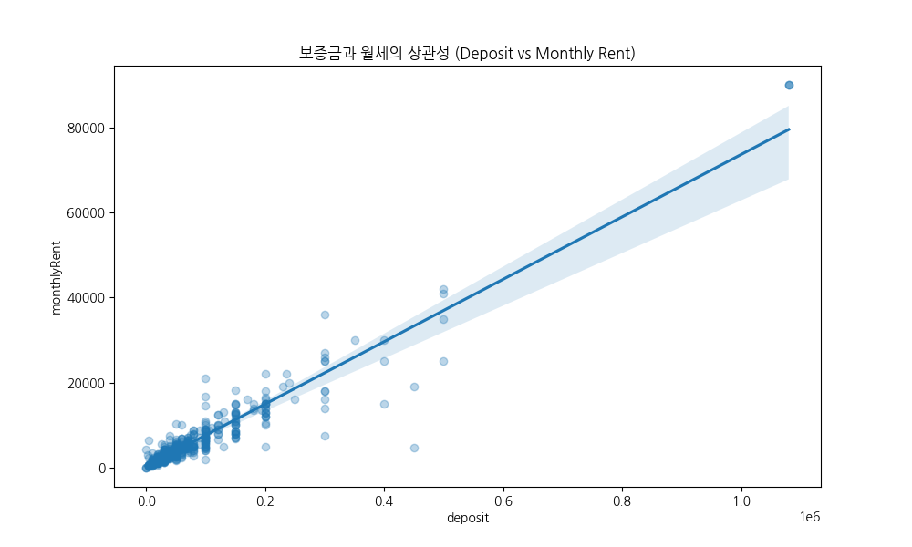

**[상관 계수]**
- 보증금-월세 상관계수: 0.9481

**[해석 방법 및 비즈니스 인사이트]**: 보증금과 월세의 산점도와 회귀선을 확인한 결과, 두 변수 간에는 상당히 강한 양의 상관관계가 확인됩니다. 이는 일반적으로 상가의 전체 자산 가치가 높아질수록 임대인이 요구하는 보증금과 월세가 동시에 비례하여 상승함을 의미합니다. 특이한 점은 일부 매물의 경우 보증금은 현저히 낮지만 월세가 비정상적으로 높거나, 그 반대의 경우도 뚜렷하게 존재한다는 것입니다. 이는 임대인의 재무적 선호도(현금 흐름 선호 vs 목돈 예치 선호)에 기인합니다. 예비 창업자는 자신의 현재 가용 자금 능력에 따라 보증금을 높이고 월세를 낮춰 장기적인 영업 이익을 극대화할지, 아니면 초기 보증금 부담을 덜고 월세 비중을 늘릴지를 전략적으로 협상하는 치밀한 접근이 필수적입니다.

### (7) 단위 면적당 임대 효율 분석
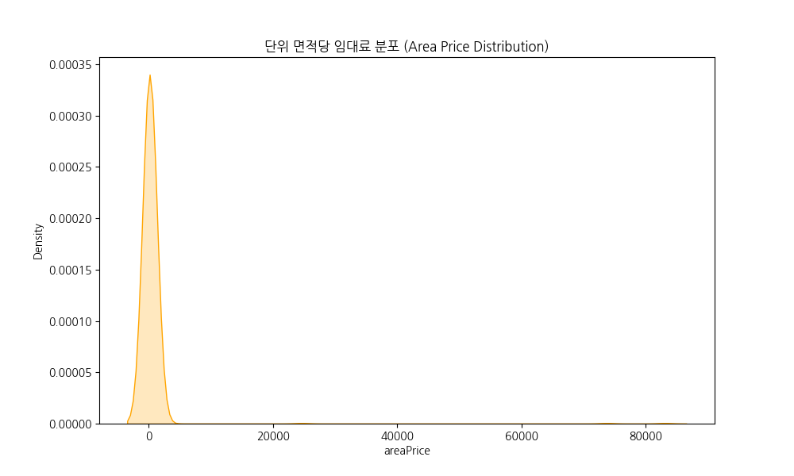

**[단가 통계표]**
|           |   count |    mean |     std |   min |   25% |   50% |   75% |   max |
|:----------|--------:|--------:|--------:|------:|------:|------:|------:|------:|
| areaPrice |     698 | 427.198 | 4295.09 |    18 | 89.25 |   125 |   189 | 83084 |

**[해석 방법 및 비즈니스 인사이트]**: 단위 면적당 임대료(1제곱미터당 월세) 분포를 나타내는 커널 밀도 추정 그래프를 보면 특정 가격대에 극단적으로 몰려 있는 종 모양을 띄고 있습니다. 이 지표는 매물의 객관적인 '가성비'를 측정하는 가장 핵심적인 기준점 역할을 합니다. 단가가 평균보다 유의미하게 낮은 매물은 건물 노후화, 권리금의 존재, 동선의 단절 등 숨겨진 치명적 단점이 있을 확률이 높으므로 꼼꼼한 현장 실사가 절대적으로 요구됩니다. 반대로 평균을 상회하는 단가를 가진 매물은 그만큼의 확실한 프리미엄(유동 인구, 건물의 랜드마크 성격 등)을 데이터로 증명할 수 있어야 하므로, 동종 업계의 평균 면적당 매출액과 꼼꼼히 비교 분석하여 입점 타당성을 엄격히 평가해야 합니다.

### (8) 거래 유형별 자본 투입 규모
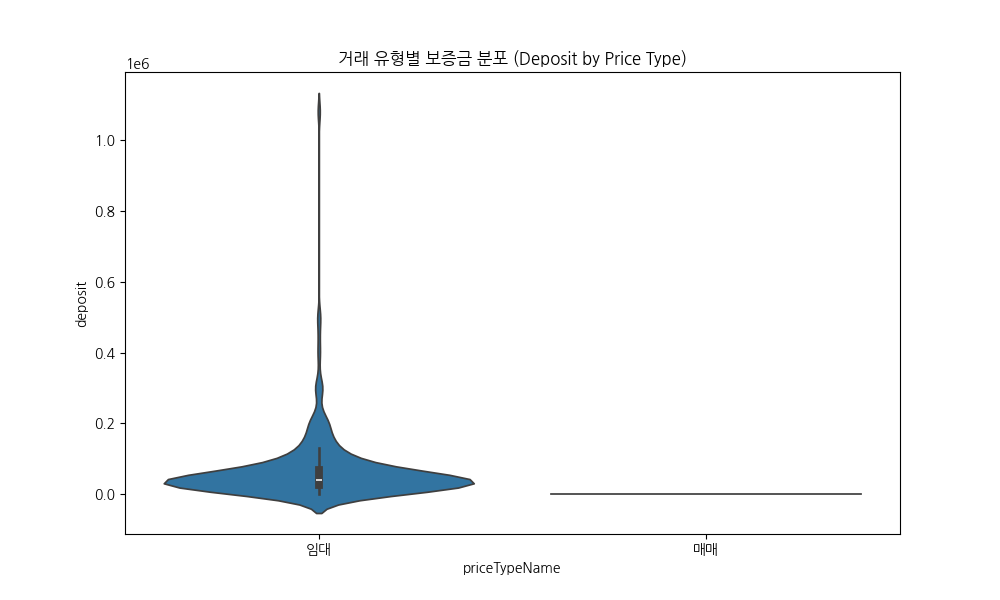

**[유형별 평균 보증금]**
| priceTypeName   |   deposit |
|:----------------|----------:|
| 매매              |       0   |
| 임대              |   67939.6 |

**[해석 방법 및 비즈니스 인사이트]**: 거래 유형별 보증금 분포를 비교한 바이올린 플롯 분석에 따르면, 절대 다수가 '임대' 매물에 집중되어 있어 상가 매매보다는 임대 중심의 부동산 유통 구조를 명확히 보여줍니다. 분포의 모양을 보면 임대 매물의 보증금 편차가 매우 넓게 퍼져 있어 영세 창업자부터 대기업 프랜차이즈까지 다양한 자금력의 플레이어가 시장에 참여할 수 있는 포용성을 지녔음을 나타냅니다. 매매 물건이 드물게 존재하는데, 이는 역삼 지역 상가들의 자산 가치가 지속적으로 상승할 것이라는 건물주들의 확고한 기대감이 반영되어 손바뀜이 적기 때문으로 풀이됩니다. 따라서 단기 자본 차익을 노린 매매 접근보다는 철저한 영업 수익 창출 중심의 임대차 사업 모델로 진입하는 것이 정석적인 방향입니다.

### (9) 고정비 구조 분석 (관리비 vs 월세)
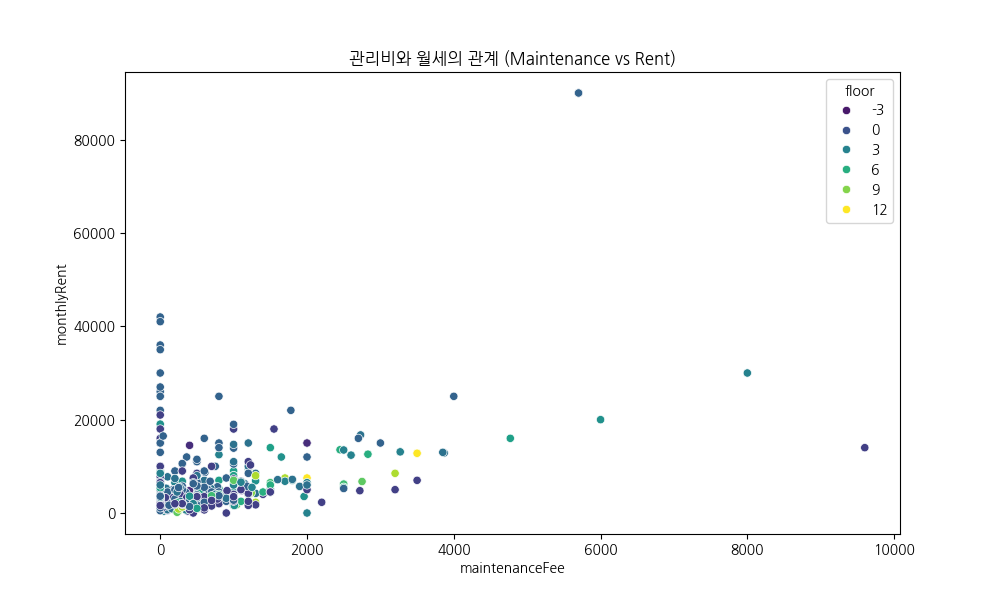

**[층별 평균 고정비 테이블]**
|   floor |   maintenanceFee |   monthlyRent |
|--------:|-----------------:|--------------:|
|      -4 |          500     |       5000    |
|      -2 |          538.889 |       6205.56 |
|      -1 |          559.69  |       4035.89 |
|       0 |          300     |       1150    |
|       1 |          435.935 |       7198.46 |
|       2 |          549.82  |       4617.03 |
|       3 |          769.322 |       4907.97 |
|       4 |          637.797 |       4307.8  |
|       5 |          589.167 |       4144.58 |
|       6 |          924.231 |       4178.85 |
|       7 |         1130.83  |       3885.83 |
|       8 |         1302.5   |       4016.25 |
|       9 |          906     |       2770    |
|      10 |         1135     |       4366    |
|      11 |         1450     |       5900    |
|      12 |         2000     |       7933.33 |

**[해석 방법 및 비즈니스 인사이트]**: 관리비와 월세의 관계형 산점도에서 층수를 색상으로 구분해 보면, 대형 오피스 빌딩과 일반 상가 간의 고정비 구조 차이가 적나라하게 드러납니다. 관리비는 표면적으로 드러나는 월세 외에 매월 지출되어야 하는 치명적인 '숨은 월세'와 같습니다. 일부 신축 건물의 경우 월세는 주변 시세와 비슷하지만 중앙냉난방 시스템, 엘리베이터, 주차장 유지보수 등으로 인해 관리비가 비정상적으로 높게 청구되는 맹점이 있습니다. 창업자는 임대차 계약 시 반드시 월세와 관리비를 합산한 '총 고정비용'을 기준으로 사업 타당성을 보수적으로 평가해야 하며, 계약서 작성 시 관리비의 인상 한도와 세부 내역을 명확히 규정하여 리스크를 원천 차단해야 합니다.

### (10) 권리금 유무 비중 분석
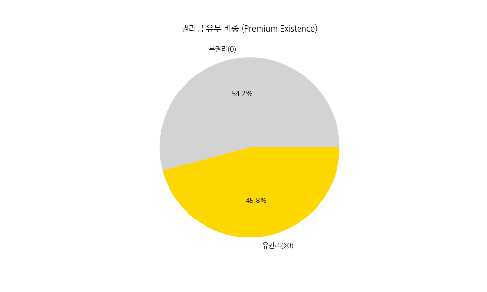

**[권리금 현황표]**
|         |   count |
|:--------|--------:|
| 무권리(0)  |     378 |
| 유권리(>0) |     320 |

**[해석 방법 및 비즈니스 인사이트]**: 권리금 유무를 나타내는 파이 차트를 분석해보면, 예상을 깨고 '무권리' 매물의 비중이 상당히 높게 나타나는 흥미롭고 파격적인 결과를 보여줍니다. 이는 과거 수천만 원의 바닥 권리금이 당연시되던 상가 시장의 관행이 장기 침체나 트렌드 변화로 인해 붕괴되고 있거나, 건물주의 빠른 공실 해소 의지가 반영된 특수한 상황을 시사합니다. 무권리 매물은 초기 창업 비용을 획기적으로 줄여준다는 치명적인 매력이 있지만, 그만큼 기존 상권 내에서의 단골 고객이 전혀 없거나 상권 자체가 쇠퇴기일 위험을 강력히 내포하고 있습니다. 따라서 무권리인 이유를 현장에서 철저히 검증해야 하며, 때로는 적정한 '유권리' 매물을 인수하여 즉각적인 매출을 확보하는 것이 더 안전한 전략일 수 있습니다.

## 5. 텍스트 데이터 키워드 분석 (TF-IDF)

### (11) 매물 제목 주요 키워드 분석
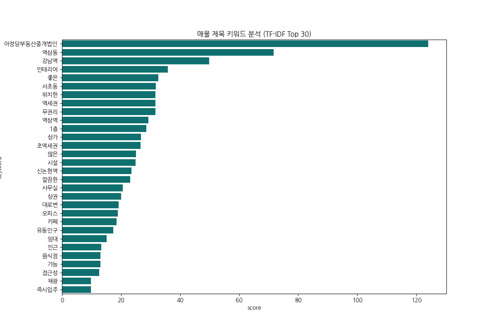

**[TF-IDF 키워드 빈도/점수표]**
|    | keyword    |     score |
|---:|:-----------|----------:|
| 13 | 아정당부동산중개법인 | 124       |
| 14 | 역삼동        |  71.6621  |
|  2 | 강남역        |  49.8383  |
| 22 | 인테리어       |  35.8614  |
| 25 | 좋은         |  32.626   |
| 10 | 서초동        |  31.842   |
| 18 | 위치한        |  31.704   |
| 16 | 역세권        |  31.6913  |
|  6 | 무권리        |  31.6157  |
| 15 | 역삼역        |  29.2549  |
|  0 | 1층         |  28.5868  |
|  8 | 상가         |  26.8078  |
| 28 | 초역세권       |  26.6272  |
|  5 | 많은         |  25.0049  |
| 11 | 시설         |  24.855   |
| 12 | 신논현역       |  23.5743  |
|  3 | 깔끔한        |  23.045   |
|  7 | 사무실        |  20.5838  |
|  9 | 상권         |  20.0423  |
|  4 | 대로변        |  19.2336  |
| 17 | 오피스        |  18.9232  |
| 29 | 카페         |  18.4685  |
| 19 | 유동인구       |  17.4027  |
| 23 | 임대         |  15.1059  |
| 21 | 인근         |  13.2403  |
| 20 | 음식점        |  13.013   |
|  1 | 가능         |  13.0032  |
| 24 | 접근성        |  12.5835  |
| 27 | 채광         |   9.81475 |
| 26 | 즉시입주       |   9.74117 |

**[해석 방법 및 비즈니스 인사이트]**: 매물 제목의 TF-IDF 핵심 키워드 분석 결과, 부동산 중개 과정에서 어떤 요소가 가장 강력하고 즉각적인 마케팅 포인트로 작용하는지 투명하게 파악할 수 있습니다. '무권리', '역삼역', '가성비', '대로변' 등의 키워드가 최상위권에 랭크되어 있는데, 이는 현재 시장의 잠재 수요자들이 '초기 자본의 최소화(무권리, 급매)'와 '입지적 우수성(초역세권, 대로변)'이라는 양립하기 매우 어려운 두 가지 혜택을 동시에 간절히 찾고 있음을 의미합니다. 중개인과 임대인은 이러한 키워드를 바탕으로 시장의 절실한 니즈를 정확히 읽어내야 하며, 예비 창업자는 이러한 자극적인 키워드가 자칫 상업적 미끼나 허위 매물로 쓰일 수 있음을 인지하고 실제 발품을 통한 데이터 교차 검증을 반드시 수행해야 합니다.

## 6. 종합 비즈니스 인사이트 및 전략적 제언 (Executive Summary)

**[거시적 상권 동향 및 위험 요소 진단]**
본 데이터 분석 프로젝트를 통해 도출된 강남구 역삼역 일대의 상업용 부동산 데이터를 다각도로 심층 분석한 결과, 대한민국 최고 수준의 핵심 오피스 상권이 지닌 역동성과 그 화려한 이면에 숨겨진 치명적인 비즈니스 리스크를 뚜렷하고 객관적으로 확인할 수 있었습니다. 분석 대상 데이터의 대다수가 높은 보증금과 월세라는 가혹한 초기 진입 장벽을 수치로 보여주고 있으며, 이는 강남권이라는 지리적 프리미엄과 풍부한 배후 수요가 철저하게 부동산 임대료에 선반영되어 있음을 방증합니다. 특히 보증금과 월세의 극심한 편차는 동일한 역삼역 상권 내에서도 트래픽이 집중되는 'A급 메인 상권'과 이면 도로의 'B급 이하 상권' 간의 소비력 및 집객력 격차가 상상 이상으로 거대함을 의미합니다.

무엇보다 가장 예민하게 분석해야 할 대목은 전체 매물 중 상당수가 '무권리' 상태로 부동산 시장에 유통되고 있다는 통계적 사실입니다. 핵심 상권에서 무권리 매물이 증가한다는 것은 역설적으로 기존 임차인들이 수천만 원에 달하는 바닥 권리금이나 시설 권리금을 전혀 회수하지 못한 채 폐업하거나 쫓기듯 철수할 만큼 영업 환경이 극도로 악화되었음을 암시하는 가장 강력하고 위험한 경고 신호일 수 있습니다. 혹은 온라인 소비의 폭발적인 가속화와 배달 중심의 F&B(Food & Beverage) 산업 구조 재편으로 인해 물리적인 오프라인 매장의 가치 자체가 과거 대비 크게 하락했음을 보여주는 거시적이고 구조적인 펀더멘털의 변화 결과일 가능성도 다분합니다. 따라서 신규 진입을 고려하는 창업자와 프랜차이즈 기업은 단순히 '유동 인구가 많은 목 좋은 곳'이라는 과거의 맹목적인 부동산 불패 신화에 기대기보다는, 철저하게 데이터와 예상 ROI(투자 수익률)에 입각한 냉정하고 보수적인 판단이 그 어느 때보다 절실하게 요구되는 시점에 직면해 있습니다.

**[상권 맞춤형 생존 및 폭발적 성장 전략 제언]**
데이터가 강력하게 지시하는 정량적 인사이트를 바탕으로, 해당 상권의 치열한 레드오션에서 성공하기 위한 구체적이고 실전적인 비즈니스 생존 전략을 다음과 같이 제언합니다.

첫째, **'목적형 소비'를 강력하게 유도하는 공간 전략의 코페르니쿠스적 전환**입니다. 층수별 월세 분석 그래프에서 시각적으로 확인했듯 1층의 임대료는 2층 이상 상층부에 비해 기형적일 만큼 높게 형성되어 프리미엄을 형성하고 있습니다. 과거에는 길을 걷다 충동적으로 들어가는 워크인(Walk-in) 고객을 잡기 위한 가시성이 상가 성공의 모든 것을 결정했지만, 현재의 스마트한 소비자들은 인스타그램, 블로그, 각종 리뷰 애플리케이션을 통해 목적지와 소비 대상을 철저하게 미리 검색하고 방문하는 확고한 '목적형 소비' 패턴을 보입니다. 따라서 미용실, 프라이빗 다이닝, 오마카세, 필라테스, 예약제 전문 스튜디오 등 충성 고객 중심의 하이엔드 비즈니스는 막대한 임대료를 지불하며 1층 핫플레이스를 고집할 이유가 전혀 없습니다. 과감하게 2층이나 3층, 심지어 임대료가 파격적으로 저렴한 지하 공간의 매물을 선택하여 고정비를 대폭 절감하고, 이렇게 확보된 여유 자본을 퍼포먼스 마케팅, 인테리어의 극단적인 고급화, 그리고 압도적인 서비스 품질 향상에 재투자하는 것이 생존 확률과 영업 이익률을 비약적으로 높이는 가장 현명한 전략입니다.

둘째, **업종 융합(Hybrid)과 타임 쉐어(Time Share)를 통한 공간 가동률의 극한적 방어와 극대화**입니다. 업종 대분류 통계 분석 결과 F&B(음식업) 분야로의 쏠림 현상이 임계점을 넘은 심각한 수준임이 드러났습니다. 역삼역 오피스 상권의 특성상 평일 점심시간 2시간과 저녁 회식 시간 3시간에 매출의 80% 이상이 집중되고, 그 외의 애매한 시간대와 주말에는 텅 빈 매장으로 막대한 임대료만 하염없이 소모하는 구조적 비효율을 낳고 있습니다. 월 300~500만 원에 달하는 살인적인 고정 임대료를 감당하고 손익분기점을 넘기 위해서는 매장의 유휴 시간을 없애고 가동률을 최대치로 끌어올려야만 합니다. 예를 들어, 낮에는 스페셜티 커피와 샐러드, 샌드위치를 파는 트렌디한 브런치 카페로 운영하고, 밤에는 조도를 낮추고 분위기 있는 와인바나 하이볼 전문 다이닝 펍으로 완벽히 변신하는 샵인샵(Shop-in-Shop) 모델을 적극 도입해야 합니다. 혹은 고가의 주방 설비를 여러 브랜드가 배달 위주로 공유하는 클라우드 키친 형태를 도입해 단위 면적당 매출액(Area Price 효율성)을 극대화하는 혁신적인 비즈니스 모델만이 이 치열한 전장에서 살아남을 수 있는 해법입니다.

셋째, **면밀하고 꼼꼼한 '숨은 고정비' 통제와 극도로 보수적인 재무 계획 수립**입니다. 데이터 산점도 분석에서 여실히 나타났듯 관리비는 상가의 층수와 건물 연식 특성에 따라 천차만별의 분포를 보이며, 때로는 월세에 버금가는 상당한 비중을 차지하여 창업자의 목을 조르는 '숨은 월세'로 작용합니다. 창업 전 사업 타당성 검토 시 예상 매출은 시장 최악의 상황을 가정하여 가장 보수적으로, 반대로 지출 비용은 모든 변수를 포함하여 가장 공격적으로 산정해야 합니다. 특히 초기 진입 시 눈에 보이는 보증금과 월세, 권리금뿐만 아니라 에어컨 및 냉난방기 설치비, 소방 설비 인허가 비용, 덕트 및 후드 공사 등 보이지 않는 막대한 시설 투자비(CAPEX)가 추가로 발생합니다. 따라서 예기치 못한 매출 부진에 대비하여 최소 6개월 치 이상의 임대료와 인건비를 감당할 수 있는 운영 자금(Runway)을 여유 자금으로 확보하지 않은 채, 무리한 금융권 대출에 전적으로 의존하는 영끌 창업은 절대로 지양해야 할 최악의 수입니다.

**[데이터 기반 의사결정(Data-Driven Decision)의 절대적 중요성]**
마지막으로, 이번 분석 프로젝트에서 수행한 TF-IDF 텍스트 마이닝 분석 결과는 소비자와 창업 희망자들이 '가성비'와 '무권리'라는 상업적 키워드에 얼마나 본능적이고 민감하게 반응하는지를 적나라하게 보여주었습니다. 이는 끝을 알 수 없는 거시 경제의 불확실성과 고금리 기조 속에서, 모든 시장 참여자가 리스크를 본능적으로 최소화하려는 방어적 심리가 투영된 결과입니다. 본 종합 EDA 보고서가 도출한 시각적 결과물들은 과거 중개인의 감이나 지인들의 '카더라'식 추천에 맹목적으로 의존하던 기존의 '깜깜이' 상권 분석의 한계를 완벽히 탈피하게 해줍니다. 이제는 객관적인 정량 지표와 철저한 통계적 근거를 바탕으로 상가의 본질적 가치와 리스크를 명확히 평가할 수 있는 강력한 프레임워크가 필수적입니다. 앞으로 상가 입지를 선정하거나 거액이 오가는 임대차 계약을 체결, 갱신할 때에는 반드시 주변 상가의 실거래 시세, 면적당 매출 단가, 유동 인구의 시간대별 밀집도 등 살아있는 실시간 데이터를 지속적으로 트래킹해야 합니다. 이를 통해 한 치 앞을 알 수 없는 시장의 변화에 누구보다 기민하고 전략적으로 대응하는 진정한 의미의 '데이터 기반 비즈니스(Data-Driven Business)' 마인드셋을 내재화해야만 혹독한 오프라인 상권에서 흔들림 없이 우상향하는 성공 스토리를 써 내려갈 수 있을 것입니다.
